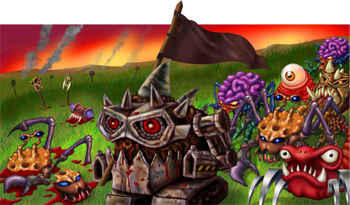

<p align="center">
  
</p>


## 📖 About This Project
This repository is a complete digital preservation and restoration of Backyard Monsters, Kixeye’s 2010 Flash-based strategy game. It features a reconstructed client, decompiled from original game files, alongside a custom-built server component implemented through extensive reverse engineering efforts.
The client runs on version 128.5690 and remains fully compatible with the original ActionScript 3 codebase, rendered through Adobe Flash Player. The backend is powered by Node.js, using the Koa framework, with a PostgreSQL database managed via MikroORM and written entirely in TypeScript.
This project aims to keep a piece of gaming history alive and playable for future generations.

<br>

## 🚀 How to Play
We recommend to download our game launcher which can be installed from our website's [download page](https://bymrefitted.com/downloads). This will allow you to seamlessly manage what build versions of the client you play, all from one place, without worrying about manually downloading new versions. The launcher currently supports Windows (64-bit) and Linux.

<br>

## 🛠️ Setup & Installation
Choose your setup method:

| Setup Type | Documentation |
|------------|---------------|
| 🖥️ **Server Setup** | [Server & Database Configuration](https://github.com/bym-refitted/backyard-monsters-refitted/wiki/Server-&-Database-Setup) |
| 🎮 **Client Setup** | [Client Recompilation Guide](https://github.com/bym-refitted/backyard-monsters-refitted/wiki/Client-Setup-(Recomp)) |
| 🐳 **Docker Setup** | [Docker Configuration](https://github.com/bym-refitted/backyard-monsters-refitted/wiki/Docker-Setup) |
| 📱 **Android Setup** | [Android APK Compilation](https://github.com/bym-refitted/backyard-monsters-refitted/wiki/Android-APK-Setup) |

<br>

## 🤝 Contributing

We welcome contributions from the community! Whether you're fixing bugs, adding features, or improving documentation, your help is appreciated.

**Ready to contribute?** Please read our [Contributing Guidelines](./CONTRIBUTING.md) to get started.

<br>

## Preservation of digital heritage
- [Exemption to PCCPSACT](https://www.federalregister.gov/documents/2018/10/26/2018-23241/exemption-to-prohibition-on-circumvention-of-copyright-protection-systems-for-access-control), exemptions to the provision of the Digital Millennium Copyright Act (“DMCA”).
- [EFGAMP](https://efgamp.eu/), the European Federation of Video Game Archives, Museums and Preservation projects.
- [UNESCO PERSIST Programme](https://unescopersist.org/), helps ensure that digital information can continue to be accessed in the future.
- [The Internet Archive](https://archive.org/), a digital library of Internet sites and other cultural artifacts in digital form.
- [Flashpoint Archive](https://flashpointarchive.org/), the webgame preservation project.
- [Adobe Flash Player Archive](https://archive.org/download/flashplayerarchive/), the Adobe Inc. archive.org Flash Player Archive.
- [Stop Killing Games](https://eci.ec.europa.eu/045/public/#/screen/home), a campaign advocating for the legal right to preserve and play digital games.

<br />

## License [](http://www.gnu.org/licenses/gpl-3.0)

```
Backyard Monsters preservation project.
Copyright (C) 2025 | The Backyard Monsters Refitted team
See the GNU General Public License <https://www.gnu.org/licenses/>.
```
