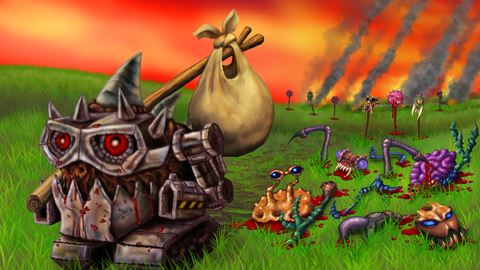

<p align="center">
  
</p>

<br />
<br />


## Repo Information
We are running a lightweight [Koa](https://koajs.com/) server written in [TypeScript](https://www.typescriptlang.org/), with a [MariaDB](https://mariadb.org/) database leveraging [MikroORM](https://mikro-orm.io/), as our ORM of choice. The client is written in [ActionScript 3](https://help.adobe.com/en_US/FlashPlatform/reference/actionscript/3/index.html) and uses [Adobe FlashPlayer](https://www.adobe.com/products/flashplayer/end-of-life.html) to display its content. 

This repository contains the entire modified SWF (Shockwave Flash) client files, along with the corresponding server component rebuilt from the ground up for Kixeye's 2010 Flash client, Backyard Monsters. The client is running on version 128.5690.

<br>

## 🚀 How to Play
We recommend to download our game launcher which can be installed from our website's [download page](https://bymrefitted.com/downloads/launcher). This will allow you to seamlessly manage what build versions of the client you play, all from one place, without worrying about manually downloading new versions. The launcher currently supports Windows (64-bit) and Linux.

<br>


## Server setup

1. Clone this repository and checkout the develop branch:

```bash
git clone https://github.com/bym-refitted/backyard-monsters-refitted
```

<br />

2. Follow the instructions carefully on our [server setup & configuration](https://github.com/bym-refitted/backyard-monsters-refitted/wiki/Server-&-Database-Setup) Wiki page.

<br />

## Client Setup

1. Follow the instructions carefully on our [client setup & configuration](https://github.com/bym-refitted/backyard-monsters-refitted/wiki/Client-Setup-&-Compilation) Wiki page.

2. To contribute you will need to copy your changes to the src directory. If you are wondering why we are using this horrible workflow please see [CONTRIBUTING.md](./CONTRIBUTING.md) for more information. If you are able to figure out how to compile directly to swf without unlinking all assets, please let us know.

<br />

## Preservation of digital heritage
- [Exemption to PCCPSACT](https://www.federalregister.gov/documents/2018/10/26/2018-23241/exemption-to-prohibition-on-circumvention-of-copyright-protection-systems-for-access-control), exemptions to the provision of the Digital Millennium Copyright Act (“DMCA”).
- [EFGAMP](https://efgamp.eu/), the European Federation of Video Game Archives, Museums and Preservation projects.
- [UNESCO PERSIST Programme](https://unescopersist.org/), helps ensure that digital information can continue to be accessed in the future.
- [The Internet Archive](https://archive.org/), a digital library of Internet sites and other cultural artifacts in digital form.
- [Flashpoint Archive](https://flashpointarchive.org/), the webgame preservation project.
- [Adobe Flash Player Archive](https://archive.org/download/flashplayerarchive/), the Adobe Inc. archive.org Flash Player Archive.

<br />

## License [](http://www.gnu.org/licenses/gpl-3.0)

```
Backyard Monsters preservation project.
Copyright (C) 2024 | The Backyard Monsters Refitted team
See the GNU General Public License <https://www.gnu.org/licenses/>.
```
